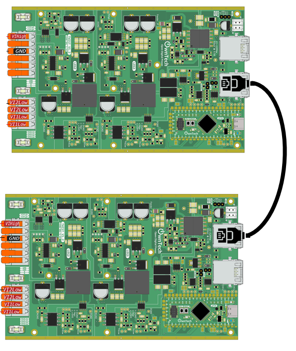

# Minimal RS485 MASTER/FOLLOWER

This tutorial shows the smallest useful RS485 exchange between two TWIST boards.

- One board is the `ROLE_MASTER`.
- One board is the `ROLE_FOLLOWER`.
- The MASTER sends a voltage reference named `voltage_ref`.
- The FOLLOWER receives it, measures/fills `voltage_meas`, then sends a reply.

The important idea is simple: RS485 sends raw bytes. In this example, those bytes
are interpreted as one C++ structure called `RS485_frame`.

## Minimal Hardware Setup



Connect two TWIST boards with an RJ45 cable, then supply both TWIST boards with at least 12 V.

## Select The Role

The same code is used on both boards. The only difference is the role selected in `main.cpp`:

```cpp
uint8_t role_id = ROLE_MASTER;
```

Flash one board with:

```cpp
uint8_t role_id = ROLE_MASTER;
```

Flash the other board with:

```cpp
uint8_t role_id = ROLE_FOLLOWER;
```

## What Is Sent On RS485

The RS485 message is defined by this structure:

```cpp
struct RS485_frame
{
    float voltage_ref;
    float voltage_meas;
    uint8_t sender_id;
    uint8_t status_code;
} __packed;
```

Each field is one piece of information exchanged between the two boards:

| Field | Written by | Read by | Meaning |
| --- | --- | --- | --- |
| `voltage_ref` | MASTER | FOLLOWER | Voltage reference requested by the MASTER |
| `voltage_meas` | FOLLOWER | MASTER | Voltage measured by the FOLLOWER |
| `sender_id` | Both boards | Both boards | Tells who sent the frame |
| `status_code` | MASTER | FOLLOWER | Tells the FOLLOWER which mode to apply, for example `IDLE` or `POWER` |

Both boards must use exactly the same `RS485_frame` definition. If you add, remove,
or reorder fields, update the code on both boards before testing.

## How The Data Moves

There are three buffers/variables to understand:

```cpp
RS485_frame frame_tx;      // Data you want to send
RS485_frame frame_rx;      // Data you have just received
uint8_t buffer_tx[...];    // Raw bytes actually sent by the RS485 driver
uint8_t buffer_rx[...];    // Raw bytes actually received by the RS485 driver
```

Before sending, the code copies the C++ structure into the RS485 transmit buffer:

```cpp
memcpy(buffer_tx, &frame_tx, sizeof(frame_tx));
communication.rs485.startTransmission();
```

After receiving, the code copies the RS485 receive buffer back into a C++ structure:

```cpp
memcpy(&frame_rx, buffer_rx, sizeof(frame_rx));
```

So the complete workflow is:

1. Put values into `frame_tx`.
2. Copy `frame_tx` into `buffer_tx`.
3. Call `communication.rs485.startTransmission()`.
4. The other board receives bytes in `buffer_rx`.
5. Copy `buffer_rx` into `frame_rx`.
6. Read values from `frame_rx`.

## Communication Flow

Every 100 us in `loop_critical_task()`:

1. MASTER fills `frame_tx`:
   - `voltage_ref = 32.0F`
   - `sender_id = ROLE_MASTER`
   - `status_code = POWER`
2. MASTER copies `frame_tx` into `buffer_tx`.
3. MASTER starts the RS485 transmission.
4. FOLLOWER receives the bytes and enters `reception_function()`.
5. FOLLOWER copies `buffer_rx` into `frame_rx`.
6. FOLLOWER reads `frame_rx.voltage_ref` and `frame_rx.status_code`.
7. FOLLOWER fills its own `frame_tx` with `voltage_meas`.
8. FOLLOWER copies `frame_tx` into `buffer_tx`.
9. FOLLOWER starts its RS485 reply.
10. MASTER receives the reply in `reception_function()`.
11. MASTER copies `buffer_rx` into `frame_rx`.
12. MASTER reads `frame_rx.voltage_meas`.

## RS485 Configuration

RS485 is configured once in the setup:

```cpp
communication.rs485.configure(
    buffer_tx,
    buffer_rx,
    sizeof(buffer_rx),
    reception_function,
    SPEED_20M
);
```

This means:

| Argument | Meaning |
| --- | --- |
| `buffer_tx` | Buffer used by the driver to send bytes |
| `buffer_rx` | Buffer used by the driver to receive bytes |
| `sizeof(buffer_rx)` | Number of bytes expected in one received frame |
| `reception_function` | Function called automatically when a frame is received |
| `SPEED_20M` | RS485 communication speed, here 20 Mbit/s |

## Serial Console

Available keys:

- `h`: print the help menu
- `i`: switch to IDLE mode
- `p`: switch to POWER mode

Press `p` in the serial monitor to start the POWER exchange.

## Task Architecture

The example has three tasks:

- `loop_background_task`: prints status, blinks LED, then sleeps for 2 s.
- `loop_critical_task`: runs every 100 us and starts MASTER transmissions.
- `loop_communication_task`: reads the serial console.

The MASTER starts the periodic exchange from `loop_critical_task()`.
The FOLLOWER replies from `reception_function()` as soon as it receives a MASTER frame.

## Customize The Frame

To send a new value, you must do four things:

1. Add the value to `RS485_frame`.
2. Fill the value in `frame_tx` before `memcpy(buffer_tx, &frame_tx, sizeof(frame_tx));`.
3. Read the value from `frame_rx` after `memcpy(&frame_rx, buffer_rx, sizeof(frame_rx));`.
4. Make sure `buffer_tx` and `buffer_rx` are large enough for the new structure.

### Example: Add A Temperature Sent By The FOLLOWER

First, add the new field to the frame:

```cpp
struct RS485_frame
{
    float voltage_ref;
    float voltage_meas;
    float temperature_meas;
    uint8_t sender_id;
    uint8_t status_code;
} __packed;
```

On the FOLLOWER, fill the value before sending the reply:

```cpp
frame_tx.sender_id = ROLE_FOLLOWER;
frame_tx.voltage_meas = measured_voltage;
frame_tx.temperature_meas = measured_temperature;

memcpy(buffer_tx, &frame_tx, sizeof(frame_tx));
communication.rs485.startTransmission();
```

On the MASTER, read the value after receiving the reply:

```cpp
memcpy(&frame_rx, buffer_rx, sizeof(frame_rx));

if (frame_rx.sender_id == ROLE_FOLLOWER)
{
    follower_voltage = frame_rx.voltage_meas;
    follower_temperature = frame_rx.temperature_meas;
}
```

### Example: Add A Command Sent By The MASTER

First, add the command to the frame:

```cpp
struct RS485_frame
{
    float voltage_ref;
    float voltage_meas;
    float temperature_meas;
    uint8_t fan_enable;
    uint8_t sender_id;
    uint8_t status_code;
} __packed;
```

On the MASTER, fill the command before sending:

```cpp
frame_tx.sender_id = ROLE_MASTER;
frame_tx.status_code = POWER;
frame_tx.voltage_ref = 32.0F;
frame_tx.fan_enable = 1;

memcpy(buffer_tx, &frame_tx, sizeof(frame_tx));
communication.rs485.startTransmission();
```

On the FOLLOWER, read the command after receiving:

```cpp
memcpy(&frame_rx, buffer_rx, sizeof(frame_rx));

if (frame_rx.sender_id == ROLE_MASTER)
{
    voltage_reference = frame_rx.voltage_ref;
    fan_enabled = frame_rx.fan_enable != 0;
}
```