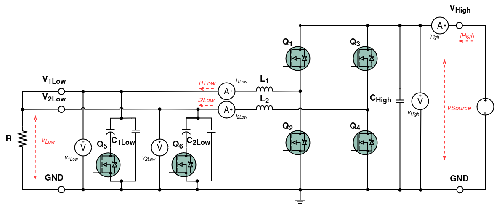
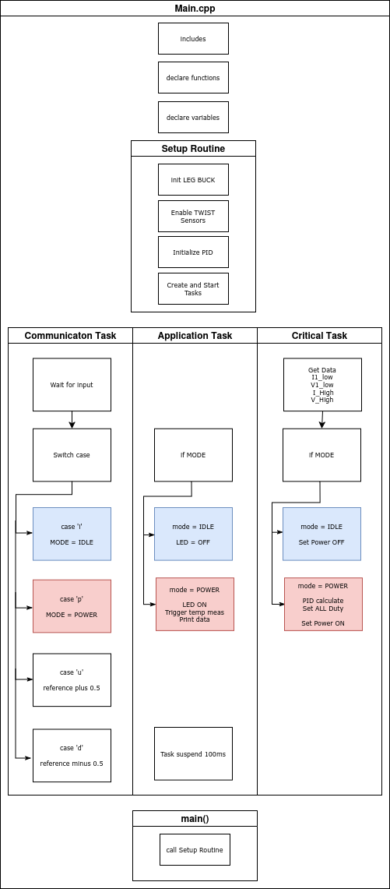
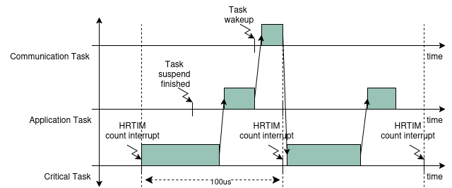
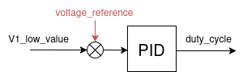

# Interleaved

Interleaved mode buck converter with PID controlled output voltage This example demonstrates the key setup, control flow, and expected outputs for this application.

!!! warning "Are you ready to start?"
    Before you can run this example, you must have successfully gone through our [getting started](https://docs.owntech.org/latest/core/docs/environment_setup/).  

## Hardware setup and requirements

The circuit diagram of the board is shown in the image below.



The wiring diagram is shown in the figure below.


!!! warning Hardware pre-requisites 
    You will need:
    - 1 TWIST
    - An appropriate power supply for your setup
    - Any load/sensors required by the example

#### Main code structure

The `main.cpp` structure is shown in the image below.



The code structure is typically organized as follows (task names can vary per example):
- Initialization of board peripherals and application state
- **Setup Routine** - sets up the hardware and software configuration
- **Communication Task** - handles user I/O or external interfaces (if any)
- **Application Task** - implements the main application logic and reporting
- **Critical Task** - time-critical control or ISR-driven routines (if any)

The tasks are executed following the diagram below. 



#### Control scheme

If this example uses a control loop, ensure the control library is included in `platformio.ini`:

```
lib_deps=
    control_lib = https://github.com/owntech-foundation/control_library.git
```

Initialize your controller (PID/PI/etc.) in code as needed, for example:

```cpp
// Example controller init
// pid.init(pid_params);
```

A control diagram placeholder is shown below.



## Expected result

This example should build and run on TWIST. Observe the behavior on the hardware and/or the serial monitor as appropriate for this example.


When opening it for the first time, the serial monitor may provide initialization or status messages as shown below.  


!!! tip Command keys
    Use the serial help menu printed by the example (if any) to discover available commands.

An example runtime interaction is shown below.


!!! note The data that you see
    If the example streams data over serial, refer to `main.cpp` for the output format and units.

    A placeholder plot is shown below:

    
