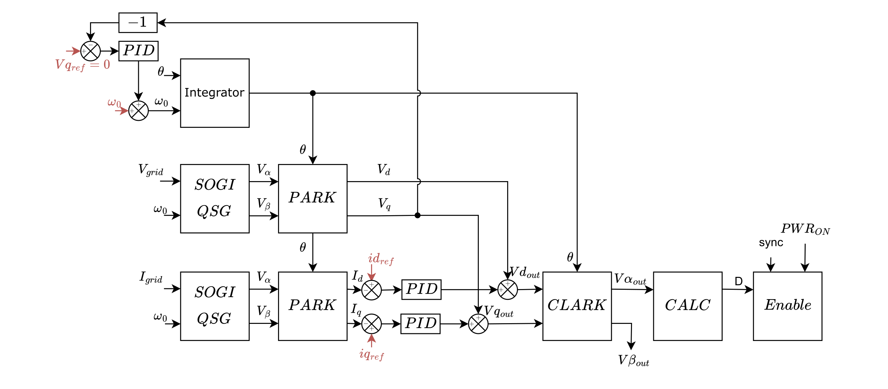

# Grid-Following PLL

This standalone example uses `singlePhaseInverter` in `FOLLOWING` mode. It demonstrates PLL synchronization before enabling power, then current regulation once the PLL is locked.

The PLL input can be selected at runtime:

- `1`: firmware-generated teaching sine from `ot_modulo_2pi()` and `ot_sin()`.
- `2`: measured grid voltage from `V1_LOW - V2_LOW`.

PWM is enabled only after the PLL reports synchronization and the estimated frequency is within the 50 Hz tolerance.

## What This Example Shows

- `singlePhaseInverter` initialized in `FOLLOWING` mode.
- A local teaching source that lets the PLL lock without relying on measurements.
- A measured source that lets the PLL lock from `V1_LOW - V2_LOW`.
- Power enable gated by `inverter.getSync()` and the frequency tolerance check.
- Sustained desynchronization returning the state machine to idle.
- Current reference tuning through `Idq_ref.d`.

The same hardware wiring is used for both PLL input modes. In measured mode, verify that the voltage sensing path is connected before pressing `p`.

## Serial Controls

- `h`: print help.
- `1`: select local sine as the PLL input.
- `2`: select measured `V1_LOW - V2_LOW` as the PLL input.
- `p`: enter startup and wait for PLL sync before power mode.
- `i`: return to idle and stop PWM.
- `u/j`: increase/decrease `Idq_ref.d` by 0.1 A.
- `d/c`: increase/decrease `Idq_ref.d` by 1 A.
- `r`: dump scope data.
- `t`: trigger scope capture.

The serial monitor should show the selected input mode, sync state, PLL input voltage, current reference, and estimated frequency.

## Test Procedure

1. Build.
2. Upload.
3. Open the serial monitor and press `h`; the help menu should list both PLL input choices.
4. Press `1`, then `p`; verify `sync` becomes `1` before PWM starts.
5. Press `t`, then `r`, and compare the selected `pll_vgrid` source with `local_vgrid` or `Vgrid`.
6. Check `pll_vgrid`, `local_vgrid`, `theta`, `omega`, `sync`, `duty_cycle_1`, and `duty_cycle_2` in scope data.
7. Press `i`, then `2`, then `p`; verify the PLL locks from measured `V1_LOW - V2_LOW`.
8. Use `u`, `j`, `d`, and `c` to tune the `d` current reference.
9. Remove or disturb the PLL input and verify sustained desync returns the state to idle.
10. Force or simulate overcurrent above 8 A and verify the state enters `ERRORMODE`.

## Expected Behavior

In local-sine mode, `pll_vgrid` should follow `local_vgrid`, and the PLL should synchronize without a physical grid measurement. In measured mode, `pll_vgrid` should follow `V1_LOW - V2_LOW`; synchronization depends on the measurement amplitude and wiring quality.
