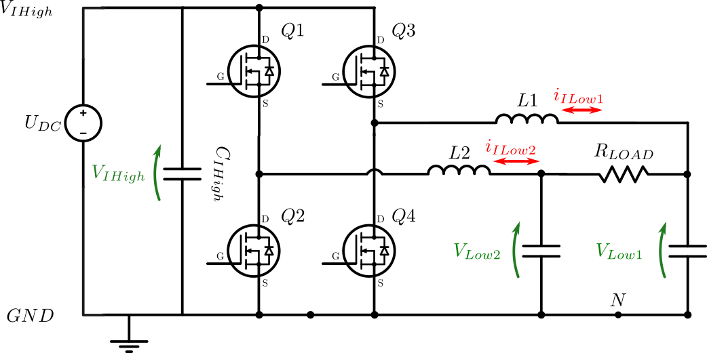
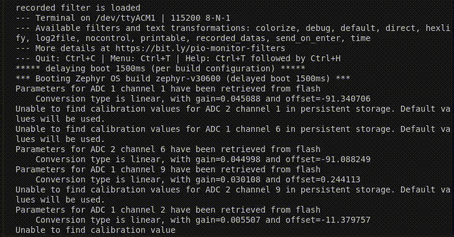

# Grid-Forming With Local Sine

This standalone example uses `singlePhaseInverter` in `FORMING` mode. It is the closed-loop voltage-control step after the open-loop sine PWM example.

The controller receives a firmware-generated teaching voltage/current pair:

- `local_vgrid = local_voltage_amplitude * ot_sin(theta)`
- `local_igrid = local_vgrid / LOAD_RESISTANCE`

The generated signals are teaching inputs for the controller. They are not a PLL bypass.



## What This Example Shows

- Local 50 Hz teaching sine generation with OwnTech trigonometry helpers.
- `singlePhaseInverter` initialized in `FORMING` mode.
- Voltage reference tuning through `Vdq_ref.d`.
- Startup ramp to the neutral 0.5 duty point before entering `POWERMODE`.
- Scope acquisition of local signals, measured signals, `dq` values, and PWM duties.

The high-level forming path is voltage-oriented: the inverter creates the grid reference instead of locking to an external one.


## Build

```bash
/home/luiz-villa/.platformio/penv/bin/pio run -e USB_grid_forming
```

Upload with:

```bash
/home/luiz-villa/.platformio/penv/bin/pio run -e USB_grid_forming -t upload
```

## Serial Controls

- `h`: print help.
- `p`: ramp the bridge to startup and enter power mode.
- `i`: return to idle and stop PWM.
- `u/j`: increase/decrease `Vdq_ref.d` by 1 V.
- `d/c`: increase/decrease `Vdq_ref.d` by 5 V.
- `r`: dump scope data.
- `t`: trigger scope capture.

The serial monitor is used both for commands and for retrieving scope data.



## Test Procedure

1. Build with `pio run -e USB_grid_forming`.
2. Upload with `pio run -e USB_grid_forming -t upload`.
3. Open the serial monitor and press `h`; the help menu should list the grid-forming controls.
4. Press `p` and verify the duty ramps to 0.5 before entering `POWERMODE`.
5. Watch `local_vgrid`, `local_igrid`, `Vd_ref`, `Vd_in`, `Vq_in`, `Id_in`, `Vd_out`, `duty_cycle_1`, and `duty_cycle_2` in scope data.
6. Use `u`, `j`, `d`, and `c` to tune the voltage reference.
7. Press `t`, then `r`, and confirm the captured local sine and duty-cycle response are coherent.
8. Press `i` and verify PWM stops.
9. Force or simulate overcurrent above 8 A and verify the state enters `ERRORMODE`.

## Expected Behavior

In power mode, the inverter should synthesize a 50 Hz voltage reference from the local teaching sine. Increasing `Vdq_ref.d` also increases `local_voltage_amplitude`, so the generated teaching input and voltage-control reference remain aligned.
