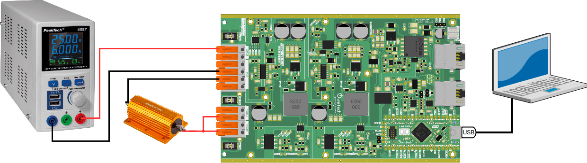
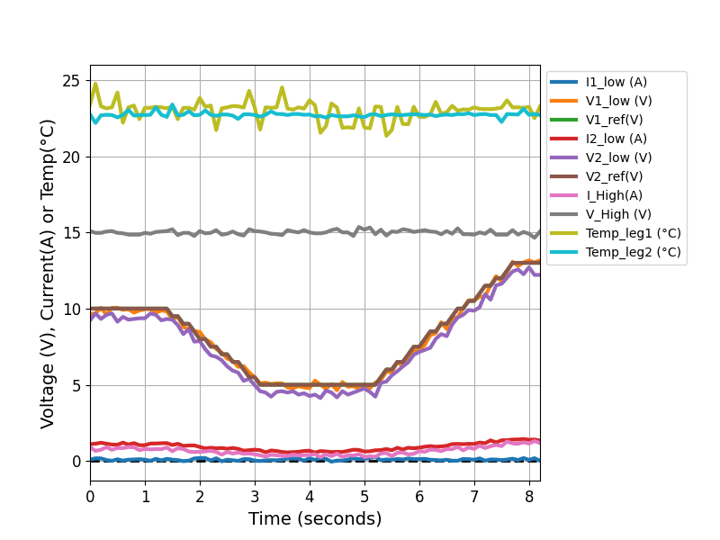

# Open-Loop Sine PWM

This standalone example drives the two TWIST legs with complementary sine PWM. It does not use `singlePhaseInverter`; it is the simplest reference for checking PWM generation, duty clamping, task scheduling, measurements, and serial control before moving to closed-loop inverter examples.



## What This Example Shows

- A local 50 Hz teaching sine generated with `ot_modulo_2pi()` and `ot_sin()`.
- Direct conversion from the local sine voltage to complementary H-bridge duties.
- Duty clamping to keep both legs inside `[0.1, 0.9]`.
- Current protection using `I1_LOW` and `I2_LOW`.
- Scope acquisition for checking the measured values and PWM commands.

The electrical context is the same H-bridge/load setup used by the other teaching examples.


## Control Path

The open-loop duty command is calculated directly from the local teaching sine and the measured DC bus voltage:

```cpp
delta_duty_cycle = 0.5F + local_vgrid / (2.0F * control_bus_voltage());
```

There is no voltage or current feedback controller in this example. The measured channels are used for telemetry and protection.


## Build

```bash
/home/luiz-villa/.platformio/penv/bin/pio run -e USB_open_loop
```

Upload with:

```bash
/home/luiz-villa/.platformio/penv/bin/pio run -e USB_open_loop -t upload
```

## Serial Controls

- `h`: print help.
- `p`: start power mode.
- `i`: return to idle and stop PWM.
- `u/j`: increase/decrease sine amplitude by 1 V.
- `d/c`: increase/decrease sine amplitude by 5 V.
- `r`: dump scope data.
- `t`: trigger scope capture.

Open the PlatformIO serial monitor after upload:


## Test Procedure

1. Build with `pio run -e USB_open_loop`.
2. Upload with `pio run -e USB_open_loop -t upload`.
3. Open the serial monitor and press `h`; the help menu should list the open-loop controls.
4. Press `p` and verify `duty_cycle_1` and `duty_cycle_2` are complementary.
5. Use `u`, `j`, `d`, and `c` to change amplitude and verify the duty clamp stays within `[0.1, 0.9]`.
6. Press `t`, then `r`, and inspect `local_vgrid`, `sine`, `duty_cycle_1`, and `duty_cycle_2`.
7. Press `i` and verify PWM stops.
8. Force or simulate overcurrent above 8 A and verify the state enters `ERRORMODE`.

The expected scope trend is a sinusoidal teaching command with complementary duty cycles. The plot below is representative of the kind of multi-channel capture expected from the examples.


